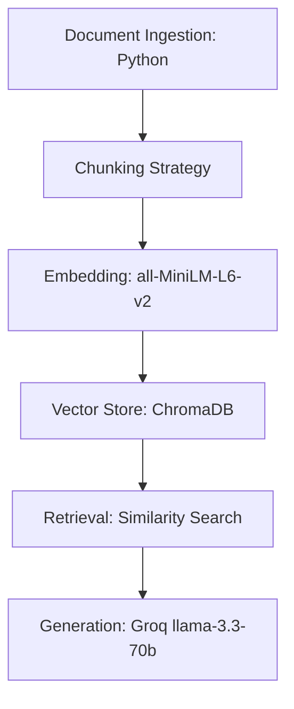

# Project 1 Planning: The Unofficial Guide

> Write this document before you write any pipeline code.
> Your spec and architecture diagram are what you'll use to direct AI tools (Claude, Copilot, etc.) to generate your implementation — the more specific they are, the more useful the generated code will be.
> Update the Retrieval Approach and Chunking Strategy sections if you change your approach during implementation.
> Update this file before starting any stretch features.

---

## Domain

<!-- What domain did you choose? Why is this knowledge valuable and hard to find through official channels? -->
The Unofficial Guide to Band Lore and Concert Culture. Official band websites are honestly pretty useless for anything beyond buying tickets or hoodies. If you actually want to understand the deep overarching stories connecting the albums, predict the setlists, or just figure out the unwritten rules for the pit, you have to dig through massive Reddit mega-threads and fan wikis to piece it all together.

---

## Documents

<!-- List your specific sources: URLs, subreddit names, forum threads, or file descriptions.
     Aim for at least 10 sources that together cover different subtopics or perspectives within your domain. -->

| # | Source | Description | URL or location |
|---|--------|-------------|-----------------|
| 1 | r/SleepToken | A massive, track-by-track breakdown of Vessel's relationship with the deity "Sleep.   " | https://www.reddit.com/r/SleepToken/comments/13tsicb/the_complete_lore_of_sleep_token/ |
| 2 | r/SleepToken | A deep-dive discussion into whether "Sleep" represents a literal deity, Greek mythology (Hypnos), or a toxic relationship. | https://www.reddit.com/r/SleepToken/comments/1gyfnd8/the_lore/ |
| 3 | r/SleepToken | A survival guide focusing on the emotional weight of the crowd, the lack of traditional stage banter, and merch table lines. | https://www.reddit.com/r/SleepToken/comments/1jj00jg/first_concert_what_to_expect/ |
| 4 | r/SleepToken | Community warnings about the physical intensity of the light shows, post-concert emotions, and hearing protection. | https://www.reddit.com/r/SleepToken/comments/1ecqvny/going_to_see_sleep_token_on_nov_very_excited_what/ |
| 5 | r/GhostBand | A highly detailed breakdown of the Clergy, the Ministry in Linköping, and the chronological ascension of the Papas. | https://www.reddit.com/r/GhostBand/comments/1f7e2ln/can_someone_explain_the_lore_of_ghost/ |
| 6 | r/Ghostbc | An exhaustive timeline detailing how the microphone is passed between the different incarnations of Papa Emeritus. | https://www.reddit.com/r/Ghostbc/comments/9lx0bc/full_ghost_lore/ |
| 7 | r/GhostBand | A broader overview of the Nameless Ghouls and the satirical, quasi-religious hierarchy of the band's universe. | https://www.reddit.com/r/GhostBand/comments/16a9jvq/can_someone_please_explain_ghost_lore/ |
| 8 | r/Explainlikeimscared | A comprehensive guide on general admission survival, the protective nature of metal crowds, and navigating the perimeter of a mosh pit. | https://www.reddit.com/r/Explainlikeimscared/comments/1s2c4im/what_should_i_expect_from_a_heavy_metal_concert/ |
| 9 | r/AftershockFestival | A dense thread outlining the unwritten rules of crowd surfing, territorial slam dancing, and pit safety. | https://www.reddit.com/r/AftershockFestival/comments/1nxojzd/psa_for_mosh_pits_just_crowds/ |
| 10 | r/StLouis | Specific community discussions regarding the crowd energy and pit behavior unique to Rob Zombie's shows. | https://www.reddit.com/r/StLouis/comments/1f78rbx/rob_zombie_show/ |

---

## Chunking Strategy

<!-- How will you split documents into chunks?
     State your chunk size (in tokens or characters), overlap size, and explain why those
     numbers fit the structure of your documents.
     A review-heavy corpus warrants different chunking than a long FAQ. -->

**Chunk size:** 900 characters

**Overlap:** 175 characters

**Reasoning:** Since my sources are mostly deep-dive Reddit threads and fan wikis, the information is usually grouped into long, multi-sentence paragraphs explaining complex lore or giving detailed concert advice. If I make the chunks too small, I risk cutting a theory in half, which would make it lose all context. 900 characters is usually enough to capture a full thought or a detailed Reddit comment, and it stays within the ~1,000-character (256-token) input window of `all-MiniLM-L6-v2`, so the entire chunk gets embedded rather than silently truncated. The 175-character overlap ensures that if a key term—like "Papa Emeritus" or "Cardinal Copia"—happens right at the split, it doesn't get chopped in half and missed by the search.

**Chunking method:** I use **paragraph-aware** chunking rather than a blind character split. Each surviving Reddit comment / lore paragraph is treated as one unit, and I greedily pack consecutive whole paragraphs into a chunk until adding the next one would exceed 900 characters. This means chunks start and end on paragraph boundaries (whole comments) instead of mid-sentence, which keeps each chunk self-contained—important for a conversational source like Reddit where one comment is usually one coherent opinion or theory. When a chunk closes, the trailing paragraph(s) that fit within the 175-character overlap are repeated at the start of the next chunk to preserve context across the seam. The only time a paragraph is split mid-paragraph is the rare case where a single comment is longer than 900 characters, in which case it falls back to a word-boundary split (never mid-word). Because chunks pack whole paragraphs, their lengths vary (roughly 650–900 characters) instead of all sitting at the 900 limit.

---

## Retrieval Approach

<!-- Which embedding model are you using (e.g., all-MiniLM-L6-v2 via sentence-transformers)?
     How many chunks will you retrieve per query (top-k)?
     If you were deploying this for real users and cost wasn't a constraint, what tradeoffs
     would you weigh in choosing a different embedding model — context length, multilingual
     support, accuracy on domain-specific text, latency? -->

**Embedding model:** `all-MiniLM-L6-v2` (via sentence-transformers)

**Top-k:** 4

**Production tradeoff reflection:** Even though I have $50 in Claude API credits available for this course, I am sticking with the local `all-MiniLM-L6-v2` model for this initial prototype to ensure rapid development and avoid API debugging. If I were deploying this to production, I would use those credits to shift the architecture to the Anthropic ecosystem. I would swap the local embeddings for Voyage AI (Anthropic's embedding partner), which handles domain-specific jargon much better, and use Claude 3.5 Sonnet for the generation step. The tradeoff is moving from a free, local setup to a paid API with network latency, but the leap in reasoning quality for connecting obscure band lore would absolutely justify the cost.

---

## Evaluation Plan

<!-- List your 5 test questions with their expected correct answers.
     Questions should be specific enough that you can judge whether the system's response
     is right or wrong. "What are good dining halls?" is too vague.
     "What do students say about wait times at [dining hall name] during lunch?" is testable. -->

| # | Question | Expected answer |
|---|----------|-----------------|
| 1 | According to the community lore, what specific physical trait is shared by all Papas from the Emeritus bloodline? | They all have one green eye and one white eye. |
| 2 | In the track-by-track lore breakdown, what does Vessel waking up in a hospital in the song "Atlantic" signify regarding his connection to Sleep? | It signifies a failed suicide attempt meant to sever his connection with the deity Sleep. |
| 3 | Who is Cardinal Copia in relation to Papa Nihil before he officially becomes Papa Emeritus IV? | He is Papa Nihil's right-hand man and the second most frequent recipient of the Employee of the Month award. |
| 4 | What is the generally accepted etiquette for a heavy metal fan who wants to be near the stage but completely avoid moshing? | Keep to the perimeter of the circle pit, where bigger fans typically stand to act as a physical shield for those who don't want to participate. |
| 5 | What specific piece of advice do veteran fans repeatedly give regarding cell phone usage at Sleep Token rituals? | Do not record the entire show or watch the concert through your screen; take a few photos and put the phone down to actually experience the emotional/visual aspects of the show. |

---

## Anticipated Challenges

<!-- What could go wrong? Name at least two specific risks with reasoning.
     Consider: noisy or inconsistent documents, missing source attribution, off-topic
     retrieval, chunks that split key information across boundaries. -->

1. **Reddit formatting junk:** Scraping from Reddit means I'm going to pull in a lot of weird text artifacts like `[deleted]`, spoiler tags, or "Edit: thanks for the gold" text. If my cleaning step isn't solid, that junk is going to end up in the vector store and confuse the LLM.

2. **Cross-band lore confusion:** Because I'm mixing the lore of Ghost, Sleep Token, and Rob Zombie, there is a very real risk that the retrieval step pulls a chunk about Ghost's quasi-religious themes when a user is actually asking about Sleep Token's deity. If the LLM isn't grounded properly, it might start hallucinating crossover events that don't exist.

---

## Architecture

<!-- Draw a diagram of your pipeline showing the five stages:
     Document Ingestion → Chunking → Embedding + Vector Store → Retrieval → Generation
     Label each stage with the tool or library you're using.
     You can use ASCII art, a Mermaid diagram, or embed a sketch as an image.
     You'll use this diagram as context when prompting AI tools to implement each stage. -->

---

## AI Tool Plan

<!-- For each part of the pipeline below, describe:
     - Which AI tool you plan to use (Claude, Copilot, ChatGPT, etc.)
     - What you'll give it as input (which sections of this planning.md, which requirements)
     - What you expect it to produce
     - How you'll verify the output matches your spec

     "I'll use AI to help me code" is not a plan.
     "I'll give Claude my Chunking Strategy section and ask it to implement chunk_text()
     with my specified chunk size and overlap" is a plan. -->

**Milestone 3 — Ingestion and chunking:**
- **Tool:** Claude
- **Input:** I will provide the "Documents" section and my "Chunking Strategy" (800 characters, 150 overlap). I will also specify that the source files are raw text scraped from Reddit, so the cleaning step must handle markdown and HTML artifacts.
- **Expected Output:** A Python script that loads the local text files, strips out basic Reddit formatting/markdown/HTML junk, and chunks the text according to my exact 800/150 size and overlap rules, tagging each chunk with its source filename.
- **Verification:** I will print out 5 random chunks to manually verify that the paragraphs are readable, self-contained, and aren't getting sliced in the middle of important words. I will also confirm the reported chunk lengths stay at or below 800 characters and that consecutive chunks share the 150-character overlap.

**Milestone 4 — Embedding and retrieval:**
- **Tool:** Claude
- **Input:** I will give it my pipeline diagram and the code generated from Milestone 3. I will specifically ask it to write the code connecting the chunks to the `all-MiniLM-L6-v2` model and storing them in a local ChromaDB instance, including the source filename as metadata.
- **Expected Output:** A Python script that embeds the chunks into the vector store and includes a retrieval function that returns the top 4 results for a query.
- **Verification:** I will manually run 3 of the test questions from my Evaluation Plan through the retrieval function. I'll verify it works by checking if the printed distance scores are under 0.5 and ensuring it pulls Sleep Token chunks for Sleep Token questions, rather than mixing up the band lore.

**Milestone 5 — Generation and interface:**
- **Tool:** Claude (for the application code); Groq (`llama-3.3-70b-versatile`) is the runtime LLM that generates answers
- **Input:** I will provide the Gradio skeleton code from the CodePath instructions and my strict grounding requirement: the LLM must only use retrieved context and must append the source filename to its answer.
- **Expected Output:** The final `app.py` file connecting the `llama-3.3-70b-versatile` model via the Groq API to my ChromaDB retrieval function, wrapped in a working Gradio UI.
- **Verification:** I will test the grounding by asking a trick question completely unrelated to my documents (e.g., something about Taylor Swift's concert etiquette). I will verify it passes if the system explicitly refuses to answer rather than hallucinating a response.
